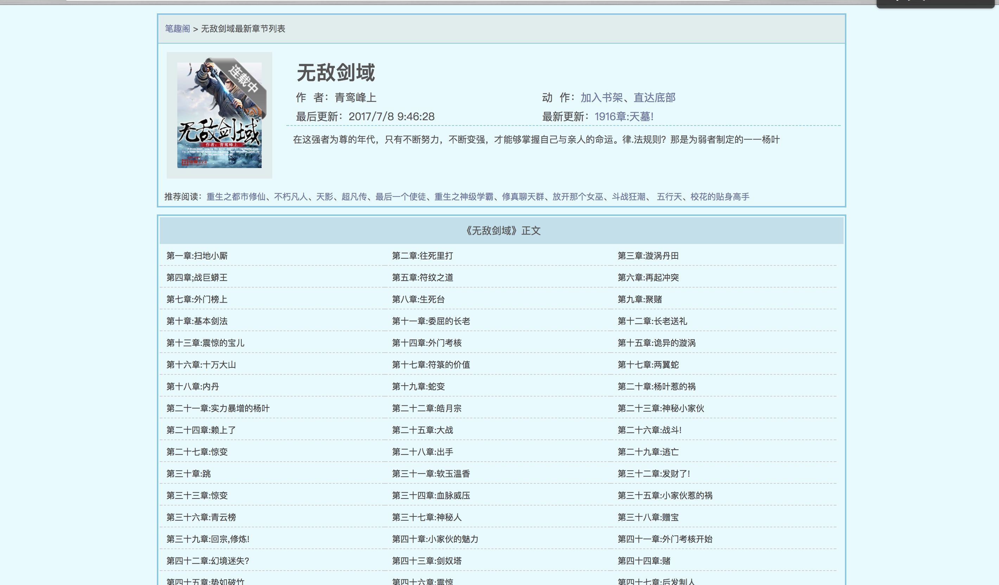
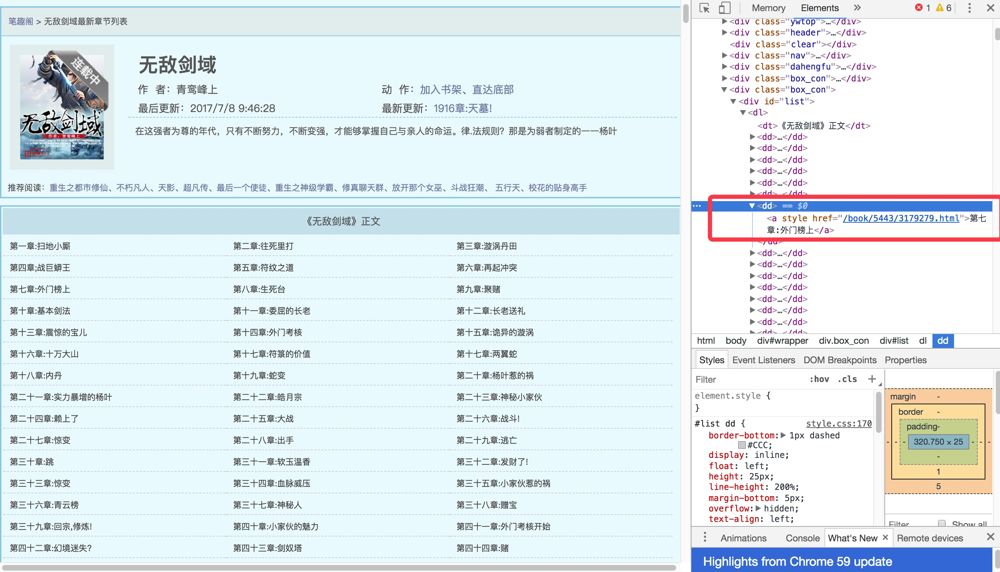
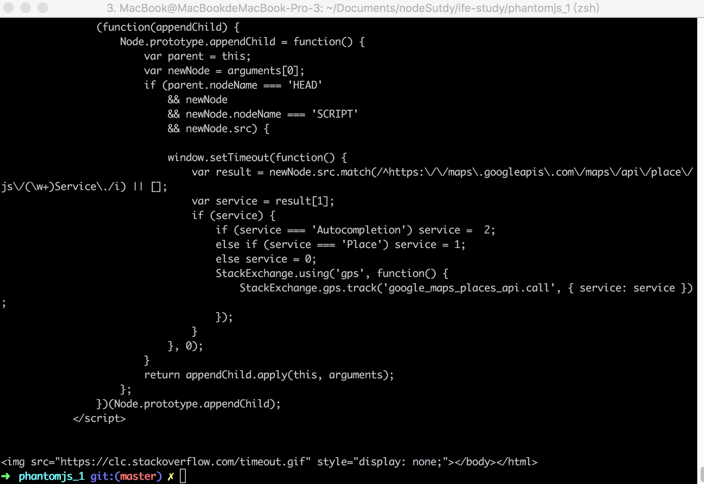
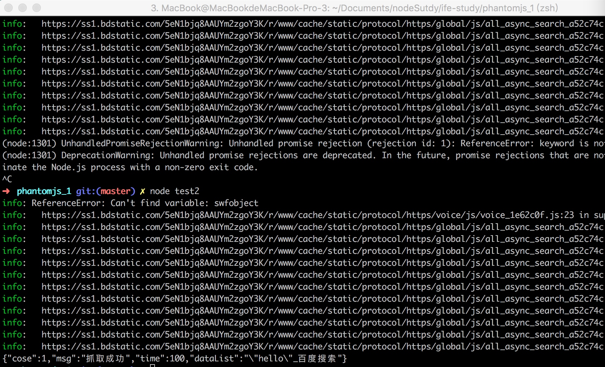
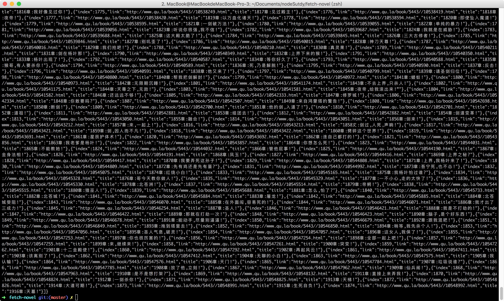
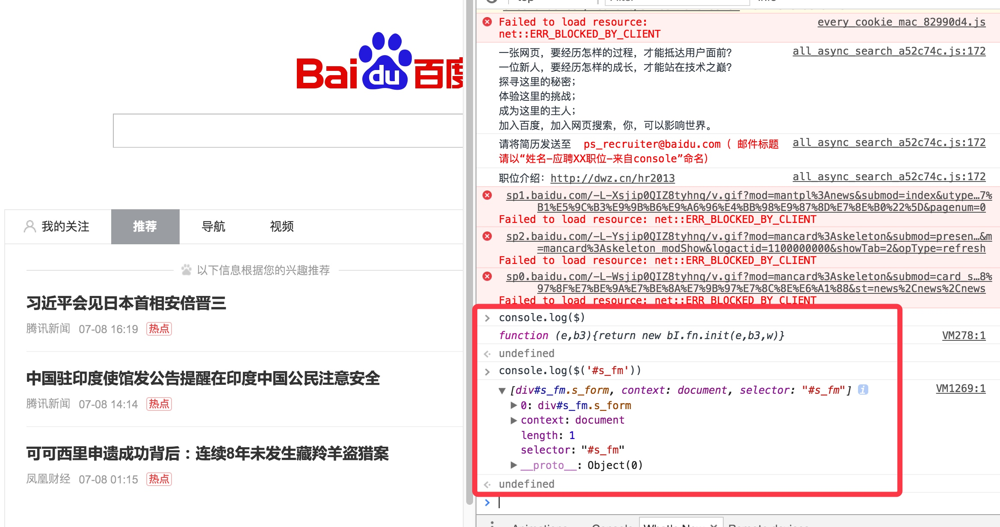
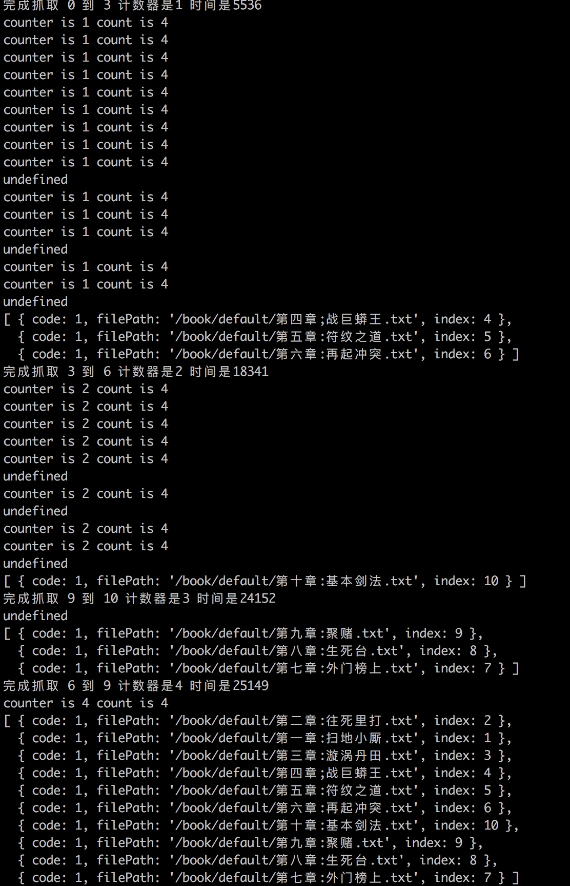
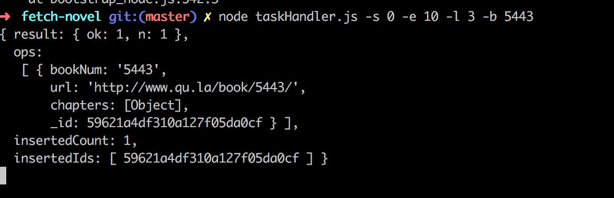
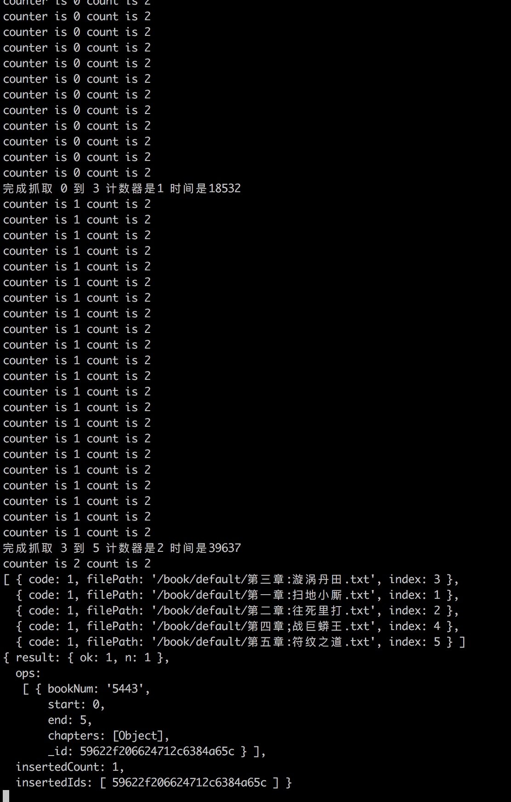

# async+phantomjs制作nodejs的小说爬虫
## 内容要点
**一步一脚印实现一个爬虫,文章内容较长,建议在pc下阅读**
**[源码地址](https://github.com/Sunshine168/fetch-novel)**
phantomjs捕获内容
详细介绍通过async.mapLimit并发处理,结合定时器进行延时执行
数据存放到mongodb
数据输出成文件 
(如有错误请大家指出，一起学习)
### 介绍(有了解可以直接跳过)
关于[PhantomJS](http://www.infoq.com/cn/news/2015/01/phantomjs-webkit-javascript-api)
 首先介绍一下phantomjs
 
> PhantomJS是一个基于WebKit的服务器端JavaScript API，它基于 BSD开源协议发布。PhantomJS无需浏览器的支持即可实现对Web的支持，且原生支持各种Web标准，如DOM 处理、JavaScript、CSS选择器、JSON、Canvas和可缩放矢量图形SVG。PhantomJS主要是通过JavaScript和CoffeeScript控制WebKit的CSS选择器、可缩放矢量图形SVG和HTTP网络等各个模块。
 
### phantomjs的应用场景

>无需浏览器的Web测试：无需浏览器的情况下进行快速的Web测试，且支持很多测试框架，如YUI Test、Jasmine、WebDriver、Capybara、QUnit、Mocha等。
页面自动化操作：使用标准的DOM API或一些JavaScript框架（如jQuery）访问和操作Web页面。
屏幕捕获：以编程方式抓起CSS、SVG和Canvas等页面内容，即可实现网络爬虫应用。构建服务端Web图形应用，如截图服务、矢量光栅图应用。
网络监控：自动进行网络性能监控、跟踪页面加载情况以及将相关监控的信息以标准的HAR格式导出。


---

基于phantomjs2.0进行实现有两种实现方案，一种是使用基于全局的 http://phantomjs.org/ ，另外一种是封装的模块 phantom - Fast NodeJS API for PhantomJS -https://github.com/amir20/phantomjs-node
这里选择phantomjs-node
关于phantomjs-node的安装以及入门
使用可以根据百度前端学院2017中的**网页抓取分析服务系列**相关内容中学习,这里放一下之前phantomjs-node [学习的笔记和demo](https://github.com/Sunshine168/ife)
 中的phantomjs_1~4目录下
后文也会进一步说明使用方法。


## 实现思路和过程

### 实现思路
phantomjs就相当于一个无图形界面的浏览器,那么我们提供连接给phantomjs就意味着我们能获取这个url的内容。
这次爬虫的内容是希望获取到小说的所有章节以及其内容,直接以笔阁网为例,因为这次爬虫是直接爬笔阁网的。
我们打开http://www.qu.la/book/5443,




上面就有这本小说的许多章节,所以就有了第一步,或者这个页面上所有章节,通过"开发者工具"中的检查共功能



我们可以看到知道内容是这样的结构

```
<div id ="list">
<dd>
<a href="/**">第xx章</a>
</dd>
....
</div>
```

所以只要我们获取 id为list 中所有的dd,就获取了小说的所有章节,同时通过dd中a标签的href属性就可以连接到所有章节的内容。

爬虫方面的思路说明到这里


### 实现过程

(请保证node版本高于7.9,本文基于7.10.0)
(最好先了解es7中async/await 以及child_process)
如何使用phantomjs-nodejs

如何运行代码？。。
将代码保存在一个js文件中例如test.js
然后运行

```
node test.js
```


[我的栗子🌰](https://github.com/Sunshine168/ife/tree/master/phantomjs_1)

```
const phantom = require('phantom');//导入模块
//async解决回调问题,es7的内容
(async function() {
     // await解决回调问题，创建一个phantom实例
    const instance = await phantom.create();
    //通过phantom实例创建一个page对象，page对象可以理解成一个对页面发起请求和处理结果这一集合的对象
    const page = await instance.createPage();
    //页面指向的是哪个一个url
    await page.on("onResourceRequested", function(requestData) {
        console.info('Requesting', requestData.url)
    });
  //得到打开该页面的状态码
    const status = await page.open('https://stackoverflow.com/');
    console.log(status);
//输出该页面的内容
    const content = await page.property('content');
    console.log(content);
    //输出内容
   //退出该phantom实例
    await instance.exit();
}());
```

输出结果



当然不可能直接使用这些内容,所以就需要通过

```
//这个方法,我的理解是跟你在chrome中的输出台的操作是一样的所以看看下面栗子
await page.evaluate(function() {});

```

```
const phantom = require('phantom');
let url = encodeURI(`https://www.baidu.com/s?wd="hello"`);
(async function() {
	const instance = await phantom.create();
	const page = await instance.createPage();
	const status = await page.open(url);
	if (status !== 'success') {
		console.log("访问失败");
		return;
	} else {
		let start = Date.now();
		let result = await page.evaluate(function() {
			return document.title
		});
		let data = {
			cose: 1,
			msg: "抓取成功",
			time: Date.now() - start,
			dataList: result
		}
		console.log(JSON.stringify(data));
		await instance.exit();
	}

}());
```

输出结果



### 模块实现
**获取所有章节fetchAllChapters.js**

```
const phantom = require('phantom');
const program = require('commander');
/*
  命令行参数帮助工具
  设置 option b 代表 book ,[book]表示该参数可以通过program访问,这个参数表示书本编号
  命令 eg:
  node fetchAllChapters.js -b 5443  
*/
program
	.version('0.1.0')
	.option('-b, --book [book]', 'book number')
	.parse(process.argv);

//缺少书本参数直接退出
if (!program.book) {
	return
}
// example "5443",获取书本编号
const bookNumber = program.book
	//访问的url
const url = encodeURI(`http://www.qu.la/book/${bookNumber}/`);
//设置用户代理头
const userAgent = `Mozilla/5.0 (Macintosh; Intel Mac OS X 10_12_4) AppleWebKit/537.36 (KHTML, like Gecko) Chrome/59.0.3071.115 Safari/537.36`
try {
	//提供async环境
	(async function() {
		//创建实例
		const instance = await phantom.create()
			//创建页面容器
		const page = await instance.createPage()
			//设置
		page.setting("userAgent", userAgent)
			//判断是否访问成功
		const status = await page.open(url),
			code = 1;
		if (status !== 'success') {
			//访问失败修改状态码
			code = -1;
		} else {
			//获取当前时间
			var start = Date.now();
			var result = await page.evaluate(function() {
				var count = 1;
				return $('#list dl dd').map(function() {
					return ({
						index: count++,
						title: $(this).find('a').html(),
						link: url + ($(this).find('a').attr('href')).substring(($(this).find('a').attr('href')).lastIndexOf("/")),
					})
				}).toArray()
			})
			let data = {
				code: code,
				bookNumber: "5443",
				url: url,
				time: Date.now() - start,
				dataList: result
			}
			console.log(JSON.stringify(data));
		}
		//退出实例
		await instance.exit();
	})()
} catch (e) {
	console.log(e)
}
```
输出结果




在获取所有章节之后,我们需要获取所有章节的内容了

**fetchChapter**

```
const phantom = require('phantom');
const mkdirp = require('mkdirp')
const program = require('commander');
const fs = require('async-file')
const path = require('path')
	//设置用户代理
const userAgent = `Mozilla/5.0 (Macintosh; Intel Mac OS X 10_12_4) AppleWebKit/537.36 (KHTML, like Gecko) Chrome/59.0.3071.115 Safari/537.36`
	/*
	命令行参数
	p -替换原文本中的换行空格
	f -保存为文件
	t 自定义输出路径
    u 抓取单章的url
	*/
program
	.version('0.1.0')
	.option('-p, --puer', 'puerMode')
	.option('-f, --file', 'save2File')
	.option('-t, --path [path]', 'outPutPath')
	.option('-u, --url [url]', 'url')
	.parse(process.argv);
if (!program.url) {
	return;

}
const URL = program.url;
const DEFAULT_PATH = '/book/default/';

/*
替换br和&nbsp标签
*/
function puer(str) {
	if (!str) {
		return
	}
	str = str.replace(/<br\s*\/?>/gi, "\r\n");
	str = str.replace(/&nbsp;/g, " ")
	return str
}
/*
test url 
node fetchChapter.js -u http://www.qu.la/book/5443/3179374.html -f -p
*/

(async function() {
	//创建实例
	const instance = await phantom.create()
		//创建页面容器
	const page = await instance.createPage()
	page.setting("userAgent", userAgent)
	const status = await page.open(URL),
		code = 1;
	if (status !== 'success') {
		code = -1;
		return;
	} else {
		// await page.includeJs("https://cdn.bootcss.com/jquery/1.12.4/jquery.js")
		// await page.render('germy.png');
		var start = Date.now();
		var result = await page.evaluate(function() {
			//移除一些无关内容(等于直接在结果网页上的dom上进行操作)
			//请注意这里如果调用console.log()是无效的!
			$("#content a:last-child").remove()
			$("#content script:last-child").remove()
			$("#content div:last-child").remove()
			$("#content script:last-child").remove()
			return ({
				title: $("h1").html(),
				content: $("#content").html()
			});
		})
		if (result.title == '' || result.content == '') {
			//内容为空捕获失败
			console.log(JSON.stringify({
				code: -1
			}))
			return
		} else {
			//判断参数进一步处理
			if (program.puer) {
				var context = puer(result.content)
			}
			//文件模式处理后进行保存到文件.返回文件路径
			if (program.file) {

				let path = ""
				if (program.path) {
					//自定义路径
				} else {
					path = DEFAULT_PATH;
					//避免文件夹不存在,__dirname指向的是文件所在路径
					mkdirp(__dirname + path, (err) => {
						if (err) {
							console.log(err);
						}
					});
					//拼接出文件输出的路径
					path += result.title + ".txt";
					await fs.writeFile(__dirname + path, context)
						// return;
						//输出文件名
					console.log(JSON.stringify({
						code: 1,
						filePath: path
					}))
				}
			} else {
				console.log(JSON.stringify({
					code: 1,
					content: result
				}));
			}

		}
	}
	//exit
	await instance.exit();
})()
```

### 拓展


```
 await page.includeJs("https://cdn.bootcss.com/jquery/1.12.4/jquery.js")
 //可以导入其他js lib
 await page.render('germy.png');
 //渲染当前页面为图片输出
 
```

在这里说一下为什么可以直接使用jquery,以百度为例子


因为当前页面加载的时候加载了jquery 这个lib,所以这里就可以直接使用了

### 结合使用

**taskHandler**

```
const exec = require('child_process').exec;
const execAsync = require('async-child-process').execAsync;
const delayAsync = require('./asyncFetch').delayAsync;
const program = require('commander');
let cmd;
/*
s 是章节开始(下标是0,所以需要手动减一,第一章就是 0)
e 是结束章节数
l 是并发数
m 模式
b 书的编号
test command:
node taskHandler.js -s 0 -e 10 -l 3 -b 5443
*/
program
	.version('0.1.0')
	.option('-s, --start [start]', 'start chapter', 0)
	.option('-e, --end [end]', 'end chapter')
	.option('-l, --limit [limit]', 'limit async', 3)
	.option('-m, --mode [mode]', 'Add bbq sauce', 2)
	.option('-b, --book [book]', 'book number')
	.parse(process.argv);
/*
 第一步获取章节连接,第二部获取章节内容并进行输出
 输出方式一 输出到数据库.(未实现)
 输出方式二 文件输出(在关注react-pdf,希望支持pdf输出)
*/
if (!program.book) {
	return
} else {
	cmd = `node fetchAllChapters.js -b ${program.book}`;
}
if (!program.start || !program.end) {
	console.log("must input with start-chapter and end-chapter ")
	return;
}

//
(async function() {

	const {
		stdout
		//调取子进程 执行cmd
	} = await execAsync(cmd, {
		//default value of maxBuffer is 200KB.
		maxBuffer: 1024 * 500
	});
	let data = JSON.parse(stdout),
		start = program.start,
		end = program.end,
		limit = program.limit,
		dataList = data['dataList'],
		fetchResult = null;
		//use to debug 
		// let dataList = [1, 2, 3, 4, 5, 6, 7, 8, 9, 10];
		if (!dataList || data.length <= 0) {
			return
		}


		// console.log(dataList)
		//分发任务 每10s调取一次并发抓取10条记录 
		//截取需要的章节数
		/*根据章节,章节是一开始,默认无序章*/
		//dataList, start, end, limit
		//下面是把要抓取的内容放置到delayAsync中,后文讲述delayAsync
	try {
		fetchResult = await delayAsync(dataList, parseInt(start), parseInt(end), parseInt(limit));
	} catch (e) {
		console.log(e)
	}
})()

```

这里是将两个模块结合起来,先抓取所有章节数再进行处理

这里使用async-child-process调起子进程,然后直接获取输出在控制台中的数据作为输出结果,由于async-child-process默认控制台输出的最大字节流是5kb所以要调整最大字节流的限制,不然会报错;

### 结合async 与计时器实现延迟并发加载

这里先要说一下[async.js](https://github.com/caolan/async)这个库提供了许多控制并发的方法,关于async的demo可以看一下唐大大的[async demo](https://github.com/alsotang/async_demo),里面有许多async method 的使用 🌰 

而我们在这里使用的是 **async.mapLimit()**


```
/*
mapLimit(coll, limit, iteratee, callbackopt)
params coll 是数据集合
       limit 并发数量
       iteratee 迭代器fun(fun 提供item 和callback,通过ca)
       callcackopt collection执行完毕或者是错误出现执行的回调函数
	
A callback which is called when all iteratee 
functions have finished, or an error occurs.
 Results is an array of the transformed items 
 from the coll. Invoked with (err, results).      
*/
//
var arr = [{name:'Jack', delay:200}, 
{name:'Mike', delay: 100},
 {name:'Freewind', delay:300}, 
 {name:'Test', delay: 50}];
async.mapLimit(arr,2, function(item, callback) {
    log('1.5 enter: ' + item.name);
    setTimeout(function() {
        log('1.5 handle: ' + item.name);
        if(item.name==='Jack') callback('myerr');
        else callback(null, item.name+'!!!');
    }, item.delay);
}, function(err, results) {
    log('1.5 err: ', err);
    log('1.5 results: ', results);
});
/*
20.675> 1.5 enter: Jack
20.682> 1.5 enter: Mike
20.786> 1.5 handle: Mike
20.787> 1.5 enter: Freewind
20.887> 1.5 handle: Jack
20.887> 1.5 err: myerr
20.887> 1.5 results: [ undefined, 'Mike!!!' ]
21.091> 1.5 handle: Freewind
*/

```

```
//在看另外一段

const async = require('async');
const moment = require('moment');
var arr = [{
	name: 'Jack',
	delay: 200
}, {
	name: 'Mike',
	delay: 100
}, {
	name: 'Freewind',
	delay: 300
}, {
	name: 'Test',
	delay: 50
}];
var log = function(msg, obj) {
	//对log进行了封装。主要是增加了秒钟的输出，通过秒数的差值方便大家对async的理解。
	process.stdout.write(moment().format('ss.SSS') + '> ');
	if (obj !== undefined) {
		process.stdout.write(msg);
		console.log(obj);
	} else {
		console.log(msg);
	}
}
async.mapLimit(arr, 2, function(item, callback) {
	log('1.5 enter: ' + item.name);
	setTimeout(function() {
		log('1.5 handle: ' + item.name);
		// if (item.name === 'Jack') callback('myerr');
		callback(null, item.name + '!!!');
	}, item.delay);
}, function(err, results) {
	log('1.5 err: ', err);
	log('1.5 results: ', results);
});

/*
18.951> 1.5 enter: Jack
18.958> 1.5 enter: Mike
19.062> 1.5 handle: Mike
19.063> 1.5 enter: Freewind
19.162> 1.5 handle: Jack
19.162> 1.5 enter: Test
19.217> 1.5 handle: Test
19.367> 1.5 handle: Freewind
19.367> 1.5 err: null
19.369> 1.5 results: [ 'Jack!!!', 'Mike!!!', 'Freewind!!!', 'Test!!!' ]
*/
```

更直观的看出callcackopt的调用是在error或者全部完成后调用的,result里放着的是每次callback(null,result)调用的结果以数组的形式储存,注意如果某个函数没有使用该回调,在结果里显示就是undefined
至于结束后仍输出,就是异步机制的问题(或者说是cpu调度问题？),已经调起了控制台的输出后 callcackopt才调用


大概了解async.mapLimit的使用后来看一下目前我的实现和存在的问题


```
const async = require('async')
const execAsync = require('async-child-process').execAsync;
/*实现并发抓取的函数*/
var asyncFetch = function(data, number, method) {
		return new Promise(function(resolve, reject) {
			if (!data || data.length <= 0) {
				reject("data not exist")
			}
			let result = [];
			async.mapLimit(data, number, async(data, callback) => {
				//需要设置延时不然ip会被封掉
				let cmd = `node fetchChapter.js  -u ${data.link} -f -p`,
					json,
					//获取一个内容就输出一个
					{
						stdout
					} = await execAsync(cmd, {
						//default value of maxBuffer is 200KB.
						maxBuffer: 1024 * 500
					});
				/*将内容保存到json中*/
				json = JSON.parse(stdout);
				//保存index
				json.index = data.index;
				/*
				由于设置成了async,出现了多次触发err的情况,callback 不能正常工作,
				手动推入result中,但是这样顺序是不确定的,有待解决这个问题
				*/
				result.push(json);
				callback(null, json) //not work 
			}, function(err) {
				//回调函数在全部都执行完以后执行
				if (err) {
					reject(err)
				}
				resolve(result)
			})
		})
	}
	/*实现延时加载的函数*/
var delayAsync = function(dataList, start, end, limit) {
	return new Promise(function(resolve, reject) {
		var result = [],
			counter = 0,
			checkTimer,
			checkTimeOut,
			fetchTimers = [],
			count = Math.ceil((end - start) / limit),
			remain = start - end,
			i = 0;
		if (dataList.length <= 0) {
			//数据长度为空就返回
			reject("error")
			return;
		}
		//打印一下输入情况
		console.log(dataList)
		try {
			/*章数的开始和结束*/
			console.log(`从${start}到 ${end}`)
			let startIndex = start,
				endIndex;
			while (startIndex != end) {
				/*
				需要注意的是当剩余的任务不足以达到并发数的时候
			    要保证任务分割不能出界
				*/
				if (startIndex + limit < end) {
					endIndex = startIndex + limit;
				} else {
					//截取出界
					endIndex = end;
				}
				/*分割任务*/
				chapter = dataList.slice(startIndex, endIndex);
				//通过闭包实现IIFE保存当时抓取的情况,不使用闭包绑定的数据则是运行之后的值
				(function(startIndex, endIndex, chapter) {
					//通过tempTimer 保存下来
					let tempTimer = setTimeout(async function() {
						//获得此次任务开始执行的时间
						let startTime = new Date(),
							time, chapterResult = [];
						//进行并发捕获执行命令
						try {
							chapterResult = await asyncFetch(chapter, limit);
						} catch (e) {
							// console.log(e)
						}
						result = result.concat(chapterResult)
							//用于判断任务标记 
						counter++;
						time = new Date() - startTime;
						console.log(`完成抓取 ${startIndex} 到 ${endIndex} 计数器是${counter} 时间是${time}`)
					}, i * 1000);
					fetchTimers.push(tempTimer);

				})(startIndex, endIndex, chapter)
				i++; //控制延时
				//推进任务进行
				startIndex = endIndex;
			}
		} catch (e) {
			reject(e)
		}
		/*定时判断任务是否完成*/
		checkTimer = setInterval(function() {
			console.log(`counter is ${counter} count is ${count}`)
			if (counter == count) {
				//清除定时器
				clearTimeout(checkTimeOut);
				//清除定时器
				clearInterval(checkTimer);
				resolve(result)
			}
		}, 1000);
		//or use promise all ?
		//30s计时器判断超时,超时时间暂做距离
		checkTimeOut = setTimeout(function() {
			//超时清除所有定时器
			for (let i = 0; i < fetchTimers.length; i++) {
				clearTimeout(fetchTimers[i]);
			}
			//清除定时判断
			clearInterval(checkTimer);
			console.log("timout")
			reject(result)
		}, 30000);
	})
}

module.exports = {
	asyncFetch: asyncFetch,
	delayAsync: delayAsync,
}
```

目前在async中存在问题,callback函数不能正常工作,所以每次都是手动将结果推入结果集,导致结果集的顺序不能和原数据顺序对应,
然而async官方文档中

>The callback must be called exactly once, ideally on a later tick of the JavaScript event loop.

至少要调用一次callback？ 但是

在延时并发中考虑用await Promise.all[] 取代定时器判断任务是否结束


输出结果




### 储存到mongodb
这里使用的数据库驱动模块是 [mongolass](https://github.com/mongolass/mongolass)


#### 第一步配置mongolass并添加模型

```
const Mongolass = require('mongolass');
const moment = require('moment');
const objectIdToTimestamp = require('objectid-to-timestamp');
const mongolass = new Mongolass();
//储存的库的url 
mongolass.connect('mongodb://localhost:27017/novel');
// 根据 id 生成创建时间 created_at
mongolass.plugin('addCreatedAt', {
  afterFind: function(results) {
    results.forEach(function(item) {
      item.created_at = moment(objectIdToTimestamp(item._id)).format('YYYY-MM-DD HH:mm');
    });
    return results;
  },
  afterFindOne: function(result) {
    if (result) {
      result.created_at = moment(objectIdToTimestamp(result._id)).format('YYYY-MM-DD HH:mm');
    }
    return result;
  }
});
/*
  下面模型的意思是
  Book表
  字段      属性
  bookNum  string
  url      stirng
  chapters 对象数组 - 对象的属性是index - number ...类推
*/
exports.Book = mongolass.model('Book', {
  bookNum: {
    type: 'string'
  },
  url: {
    type: 'string'
  },
  chapters: [{
    index: {
      type: "number"
    },
    link: {
      type: "string"
    },
    title: {
      type: "string"
    }
  }]
});
//书模型
exports.Book.index({
  bookNum: 1
}, {
  unique: true
}).exec(); // 根据书本编号找到书本的章节，书编号全局唯一

/*
  下面模型的意思是
  Chapter表
  字段      属性
  bookNum  string
  start    number
  end      number
  chapters 对象数组 - 对象的属性是code - number ...类推
*/
exports.Chapter = mongolass.model('Chapter', {
  bookNum: {
    type: 'string'
  },
  start: {
    type: 'number'
  },
  end: {
    type: 'number'
  },
  chapters: [{
    code: {
      type: 'number'
    },
    filePath: {
      type: 'string'
    },
    index: {
      type: 'number'
    }
  }]
});

//抓取一次章节的模型
exports.Chapter.index({
  bookNum: 1
}, {
  unique: true
}).exec(); // 根据书本编号找到书本的章节，用户名全局唯一
```


#### 添加模型

Book

```
const Book = require('../lib/mongo').Book;

module.exports = {
  // 保存章节内容
  create: (book) => {
    return Book.create(book).exec();
  },
  //通过书编号获取记录
  getBookByBookNum: (bookNum) => {
    return Book
      .findOne({
        bookNum: bookNum
      })
    .addCreatedAt()
      .exec();
  },
  //通过编号更新书数据
  updateBookByBookNum: (bookNum, book) => {
    return Book.update({
      bookNum: bookNum,
    }, {
      $set: book
    }).exec();
  },
};
```

Chapter

```
const Chapter = require('../lib/mongo').Chapter;

module.exports = {
  // 保存章节内容
  create: (chapter) => {
    return Chapter.create(chapter).exec();
  },
  //通过书编号获取记录
  getChapterByBookNum: (bookNum) => {
    return Chapter
      .find({
        bookNum: bookNum
      })
      .addCreatedAt()
      .exec();
  },
  //通过抓取结果序号获取记录
  getChapterById: (id) => {
    return Chapter
      .findOne({
        _id: id
      })
      .addCreatedAt()
      .exec();
  },
  updateChapterByBookNum: (id, chapter) => {
    return Chapter.update({
      _id: id
    }, {
      $set: chapter
    }).exec();
  },
};
```

测试🌰(暂未使用断言库进行标准的测试)

```
const BookModel = require('../model/Books.js');
const ChapterModel = require('../model/Chapters.js');


var testStoreBook = async() => {
	//模拟数据
	let data = {
			bookNum: "4445",
			url: "www.google123.com",
			chapters: [{
				index: 5,
				link: "333",
				title: "123132"
			}, {
				index: 6,
				link: "333",
				title: "123132"
			}, {
				index: 7,
				link: "333",
				title: "123132"
			}]
		},
		bookNum = "4445"

	try {
		var query = await BookModel.getBookByBookNum(bookNum);
		// var result = await BookModel.create(data);
	} catch (e) {
		console.log(e)
	}
	console.log(result.result.ok)
		// process.exit()
}
var testStoreChapters = async() => {
		//模拟数据
		let data = {
				bookNum: "4445",
				start: 0,
				end: 10,
				chapters: [{
					index: 5,
					code: 1,
					filePath: "123132"
				}, {
					index: 6,
					code: 1,
					filePath: "123132"
				}, {
					index: 7,
					code: 1,
					filePath: "123132"
				}]
			},
			bookNum = "4445"

		try {
			// var result = await ChapterModel.updateChapterByBookNum(bookNum, data);
			var result = await ChapterModel.getChapterByBookNum(bookNum);
			console.log(result)
		} catch (e) {
			console.log(e)
		}
	// console.log(result.result.ok)
			// process.exit()
	}
	(async function() {
		try {
			// await testStoreChapters()
			// var query = await testStoreBook()
			var query = await testStoreChapters()
		} catch (e) {
			console.log(e.message)
		}
	})()
	
```


### 结合mongolass保存抓取数据

存储章节信息

```
const BookModel = require('./model/Books.js');
// ...
if (!dataList || data.length <= 0) {
		return
	}
	/*储存数据*/
	let book = {
			bookNum: data.bookNumber,
			url: data.url,
			chapters: dataList,
		},
		result = await BookModel.create(book);
	console.log(result)
//...
```
输出结果



存储章节内容

```

const ChapterModel = require('./model/Chapters.js');

//....
	try {
		fetchResult = await delayAsync(dataList, start, end, limit);
		console.log(fetchResult)
		var chapters = await Chapter.create({
			bookNum: data.bookNumber,
			start: start,
			end: end,
			chapters: fetchResult,
		});
		console.log(chapters)
	} catch (e) {
		console.log(e)
	}
```

输出结果




### 反思
目前感觉总体设计上并不是十分合理。

书本的章节可以捕获一次保存在数据库中,输入书本后判断书本是否已经捕获过章节了

捕获过就从数据库里获取需要的章节,提供方法检验是否有最新章节,

以文本形式储存阅读并不方便,如何更方便的阅读

在大量捕获的时候仍会被封停,缺少应对封停的机制

添加phantom proxy 进行代理,这里引出需要写一个抓取代理并测试的服务来提供代理池


(ps =,=寝室只能用热点上网 实在网络不顺畅)

